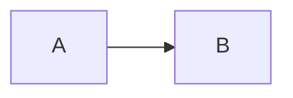

# Technical Implementation Plan: 13-Week Humanoid Robotics Curriculum

## Document Overview

**Purpose**: Define the technical structure and conventions for implementing a 13-week Humanoid Robotics curriculum in Docusaurus 3  
**Version**: 1.0  
**Date**: 2025-12-17  
**Status**: ✅ IMPLEMENTED

---

## 1. File Naming Convention

### 1.1 Directory Structure

```
docs/
├── week01-02-physical-ai/           # Weeks 1-2: Physical AI & Embodied Intelligence
│   ├── 01-foundations-of-physical-ai.md
│   └── 02-embodied-intelligence-architecture.md
├── week03-05-ros2-fundamentals/     # Weeks 3-5: ROS 2 Fundamentals
│   ├── 03-ros2-ecosystem-and-nodes.md
│   ├── 04-topics-services-actions.md
│   └── 05-parameters-launch-tf2.md
├── week06-07-simulation/            # Weeks 6-7: Simulation
│   ├── 06-urdf-modeling-gazebo-basics.md
│   └── 07-gazebo-ros-integration-control.md
├── week08-10-isaac-platform/        # Weeks 8-10: NVIDIA Isaac
│   ├── 08-isaac-sim-introduction.md
│   ├── 09-vslam-and-perception.md
│   └── 10-advanced-isaac-features.md
├── week11-12-humanoid-dev/          # Weeks 11-12: Humanoid Development
│   ├── 11-bipedal-locomotion-fundamentals.md
│   └── 12-kinematics-whole-body-control.md
├── week13-conversational/           # Week 13: Conversational Robotics
│   └── 13-speech-to-action-whisper-gpt.md
└── resources/                       # Shared resources
    ├── hardware-requirements.md
    ├── software-setup.md
    └── troubleshooting.md
```

### 1.2 Naming Convention Rules

#### Directory Names

**Format**: `weekXX-YY-topic-name`

**Components**:
- `weekXX-YY`: Week range (e.g., `week01-02`, `week03-05`, `week13`)
- `topic-name`: Descriptive topic in kebab-case (lowercase with hyphens)

**Examples**:
- ✅ `week01-02-physical-ai`
- ✅ `week03-05-ros2-fundamentals`
- ✅ `week08-10-isaac-platform`
- ❌ `Week01_Physical_AI` (wrong case and separator)
- ❌ `w1-2-intro` (not descriptive enough)

**Single Week Format**: `weekXX-topic-name`
- ✅ `week13-conversational`

#### Chapter File Names

**Format**: `NN-chapter-title-in-kebab-case.md`

**Components**:
- `NN`: Two-digit chapter number (01-13)
- `chapter-title`: Descriptive title in kebab-case
- `.md`: Markdown extension

**Numbering Scheme**:
- Chapter numbers align with the week number
- Week 1 = Chapter 01
- Week 2 = Chapter 02
- ...
- Week 13 = Chapter 13

**Examples**:
- ✅ `01-foundations-of-physical-ai.md`
- ✅ `13-speech-to-action-whisper-gpt.md`
- ❌ `1-intro.md` (single digit, not descriptive)
- ❌ `week1-foundations.md` (includes 'week' prefix)

### 1.3 Frontmatter Convention

Every chapter file must include YAML frontmatter:

```yaml
---
sidebar_position: NN
title: Chapter Title
---
```

**Required Fields**:
- `sidebar_position`: Integer matching chapter number (1-13)
- `title`: Human-readable chapter title

**Example**:
```yaml
---
sidebar_position: 1
title: Foundations of Physical AI
---
```

### 1.4 File Organization Rationale

**Why group by week ranges?**
- Reduces directory clutter (6 directories vs. 13)
- Reflects natural curriculum structure (related topics grouped)
- Easier navigation for instructors planning multi-week modules

**Why prefix with chapter numbers?**
- Ensures correct alphabetical sorting
- Makes chronological order explicit
- Enables quick reference (Chapter 5 = Week 5)

**Why kebab-case?**
- URL-friendly (no spaces or special characters)
- Consistent with Docusaurus conventions
- Improves SEO

---

## 2. Sidebar Configuration (sidebars.ts)

### 2.1 Structure Definition

```typescript
import type {SidebarsConfig} from '@docusaurus/plugin-content-docs';

const sidebars: SidebarsConfig = {
  tutorialSidebar: [
    {
      type: 'category',
      label: '📘 Weeks 1-2: Physical AI & Embodied Intelligence',
      collapsed: false,  // Keep expanded by default
      items: [
        'week01-02-physical-ai/01-foundations-of-physical-ai',
        'week01-02-physical-ai/02-embodied-intelligence-architecture',
      ],
    },
    // ... additional week groups
  ],
};

export default sidebars;
```

### 2.2 Category Configuration

Each week group follows this pattern:

```typescript
{
  type: 'category',
  label: '🎯 Weeks X-Y: Topic Name',
  collapsed: false,
  items: [
    'weekXX-YY-topic/NN-chapter-name',
    // ... more chapters
  ],
}
```

**Field Specifications**:

| Field | Type | Purpose | Example |
|-------|------|---------|---------|
| `type` | `'category'` | Defines a collapsible group | - |
| `label` | `string` | Displayed name in sidebar | `'📘 Weeks 1-2: Physical AI'` |
| `collapsed` | `boolean` | Initial collapse state | `false` (expanded) |
| `items` | `string[]` | Paths to chapter files | `['week01-02-physical-ai/01-...']]` |

### 2.3 Emoji Icons

Each week group has a descriptive emoji:

| Weeks | Emoji | Meaning |
|-------|-------|---------|
| 1-2 | 📘 | Foundational theory |
| 3-5 | 🤖 | ROS 2 robotics |
| 6-7 | 🎮 | Simulation/gaming aspect |
| 8-10 | 🎬 | Visual/cinematic (Isaac Sim rendering) |
| 11-12 | 🚶 | Locomotion/walking |
| 13 | 🗣️ | Conversational AI |

### 2.4 Path Resolution

**Format**: `'directory/filename'` (without `.md` extension)

**Important**:
- Paths are relative to `docs/` directory
- Do NOT include `.md` extension
- Do NOT include leading `/`
- Use forward slashes `/` even on Windows

**Example Mappings**:

| File Path | Sidebar Item Path |
|-----------|------------------|
| `docs/week01-02-physical-ai/01-foundations-of-physical-ai.md` | `'week01-02-physical-ai/01-foundations-of-physical-ai'` |
| `docs/week13-conversational/13-speech-to-action-whisper-gpt.md` | `'week13-conversational/13-speech-to-action-whisper-gpt'` |

### 2.5 Chronological Ordering

**Automatic Ordering**: Docusaurus renders sidebar items in the order they appear in the array.

**Our Order**:
1. Weeks 1-2 (Physical AI)
2. Weeks 3-5 (ROS 2)
3. Weeks 6-7 (Simulation)
4. Weeks 8-10 (Isaac Platform)
5. Weeks 11-12 (Humanoid Dev)
6. Week 13 (Conversational)
7. Resources (bottom)

**Within Categories**: Items sorted by chapter number (01, 02, 03...)

### 2.6 Adding New Chapters

To add a new chapter:

1. Create markdown file: `docs/weekXX-YY-topic/NN-chapter-title.md`
2. Add frontmatter with `sidebar_position: NN`
3. Update `sidebars.ts`:
   ```typescript
   {
     type: 'category',
     label: '...',
     items: [
       'existing-chapter',
       'weekXX-YY-topic/NN-new-chapter',  // Add here
     ],
   }
   ```
4. Rebuild: `npm run build` or hot-reload with `npm start`

---

## 3. Resources Page Structure

### 3.1 Directory: `docs/resources/`

Shared resources accessible throughout the course:

```
docs/resources/
├── hardware-requirements.md      # GPU specs, Jetson Orin, compute needs
├── software-setup.md             # Installation guides (ROS 2, Isaac, etc.)
├── troubleshooting.md            # Common issues and solutions
└── recommended-reading.md        # Papers, books, videos
```

### 3.2 Hardware Requirements Page

**File**: `docs/resources/hardware-requirements.md`

**Content Structure**:

```markdown
---
sidebar_position: 100
title: Hardware Requirements
---

# Hardware Requirements

## Overview
[Introduction to hardware needs across the course]

## Minimum Requirements
### Weeks 1-5 (ROS 2 Basics)
- CPU: ...
- RAM: ...
- Storage: ...
- GPU: Optional

### Weeks 6-7 (Gazebo Simulation)
- CPU: ...
- RAM: ...
- GPU: Recommended

### Weeks 8-10 (Isaac Sim)
- **GPU REQUIRED**: NVIDIA RTX 2000 series or newer
- VRAM: 8 GB minimum
- CUDA: 11.8+

### Weeks 11-13 (Full Pipeline)
- Complete system requirements

## Recommended Configurations

### Configuration 1: Budget (< $1500)
### Configuration 2: Standard ($1500-$3000)
### Configuration 3: High-Performance ($3000+)

## Embedded Platforms

### NVIDIA Jetson Orin
- Orin Nano
- Orin NX
- Orin AGX

### Deployment Considerations
```

### 3.3 Sidebar Integration

Add resources to sidebar after all week groups:

```typescript
{
  type: 'category',
  label: '📚 Resources',
  collapsed: true,
  items: [
    'resources/hardware-requirements',
    'resources/software-setup',
    'resources/troubleshooting',
    'resources/recommended-reading',
  ],
}
```

---

## 4. Build and Deployment

### 4.1 Local Development

```bash
# Start development server (hot reload enabled)
npm start

# Access at: http://localhost:3000
```

### 4.2 Production Build

```bash
# Build static site
npm run build

# Test production build
npm run serve
```

### 4.3 TypeScript Validation

```bash
# Check TypeScript types
npm run typecheck
```

### 4.4 Deployment Checklist

Before deploying:

- [ ] All chapters have proper frontmatter
- [ ] Sidebar paths match actual file paths
- [ ] Production build succeeds (`npm run build`)
- [ ] No broken links (check browser console)
- [ ] All images load correctly
- [ ] Code syntax highlighting works

---

## 5. Content Standards

### 5.1 Markdown Formatting

**Headers**:
```markdown
# H1 - Chapter Title (once per file)
## H2 - Major Sections
### H3 - Subsections
#### H4 - Details (sparingly)
```

**Code Blocks**:
````markdown
```python
def example():
    pass
```
````

**Supported Languages**:
- `python`, `cpp`, `bash`, `yaml`, `xml`, `typescript`, `jsx`, `json`

**Diagrams**:
````markdown

````

### 5.2 Frontmatter Standards

**Required**:
```yaml
---
sidebar_position: [number]
title: [string]
---
```

**Optional** (for future expansion):
```yaml
---
sidebar_position: 1
title: Chapter Title
description: SEO-friendly description
keywords: [robotics, ROS 2, humanoid]
---
```

### 5.3 Internal Linking

**Format**: Relative or absolute paths

```markdown
<!-- Relative (same directory) -->
[Next Chapter](./02-next-chapter.md)

<!-- Relative (different directory) -->
[Setup Guide](../00-introduction/02-setup-environment.md)

<!-- Absolute (from docs root) -->
[Resources](/resources/hardware-requirements)
```

---

## 6. Version Control

### 6.1 Git Structure

```
.git/
.gitignore
docs/              # Version controlled
sidebars.ts        # Version controlled
docusaurus.config.ts  # Version controlled
build/             # Ignored (.gitignore)
node_modules/      # Ignored (.gitignore)
```

### 6.2 Commit Convention

```
feat: Add Week 13 conversational robotics chapter
fix: Correct code example in Week 5
docs: Update hardware requirements
refactor: Reorganize sidebar structure
```

---

## 7. Maintenance

### 7.1 Adding New Weeks

If curriculum expands to 14+ weeks:

1. Create new directory: `docs/week14-topic/`
2. Create chapter file: `14-chapter-name.md`
3. Update `sidebars.ts`
4. Update `CURRICULUM_SPECIFICATION.md`

### 7.2 Updating Content

**Process**:
1. Edit markdown file
2. Save (hot reload in dev mode)
3. Verify in browser
4. Commit changes

### 7.3 Troubleshooting Build Errors

**Common issues**:

1. **Sidebar path mismatch**:
   - Error: "File not found"
   - Fix: Check path in `sidebars.ts` matches actual file location

2. **Invalid frontmatter**:
   - Error: YAML parsing error
   - Fix: Validate YAML syntax

3. **Duplicate sidebar_position**:
   - Warning: Multiple files with same position
   - Fix: Ensure unique positions

---

## 8. Implementation Status

### ✅ Completed

- [x] All 13 week directories created
- [x] All 13 chapter files created with content
- [x] Sidebar configuration complete
- [x] Naming conventions established
- [x] Frontmatter added to all chapters
- [x] Docusaurus configuration updated

### 🔄 In Progress

- [ ] Resources pages (hardware, software, troubleshooting)
- [ ] Additional diagrams and visuals
- [ ] Video tutorial integration

### 📋 Future Enhancements

- [ ] Interactive code sandboxes
- [ ] Quiz components
- [ ] Student project gallery
- [ ] Instructor resources section

---

## 9. Quick Reference

### Chapter Creation Checklist

When creating a new chapter:

1. ✅ Create file in correct `weekXX-YY-topic/` directory
2. ✅ Name file: `NN-descriptive-title.md`
3. ✅ Add frontmatter with `sidebar_position` and `title`
4. ✅ Write content following template
5. ✅ Add to `sidebars.ts` in correct category
6. ✅ Test in browser (`npm start`)
7. ✅ Commit to version control

### Sidebar Update Checklist

When modifying sidebar:

1. ✅ Edit `sidebars.ts`
2. ✅ Verify path format (no `.md`, no leading `/`)
3. ✅ Check category structure
4. ✅ Run `npm run typecheck`
5. ✅ Test navigation in browser
6. ✅ Verify order is correct

---

## Appendix A: File Path Examples

Complete mapping of all 13 chapters:

| Week | File Path | Sidebar Path |
|------|-----------|--------------|
| 1 | `docs/week01-02-physical-ai/01-foundations-of-physical-ai.md` | `week01-02-physical-ai/01-foundations-of-physical-ai` |
| 2 | `docs/week01-02-physical-ai/02-embodied-intelligence-architecture.md` | `week01-02-physical-ai/02-embodied-intelligence-architecture` |
| 3 | `docs/week03-05-ros2-fundamentals/03-ros2-ecosystem-and-nodes.md` | `week03-05-ros2-fundamentals/03-ros2-ecosystem-and-nodes` |
| 4 | `docs/week03-05-ros2-fundamentals/04-topics-services-actions.md` | `week03-05-ros2-fundamentals/04-topics-services-actions` |
| 5 | `docs/week03-05-ros2-fundamentals/05-parameters-launch-tf2.md` | `week03-05-ros2-fundamentals/05-parameters-launch-tf2` |
| 6 | `docs/week06-07-simulation/06-urdf-modeling-gazebo-basics.md` | `week06-07-simulation/06-urdf-modeling-gazebo-basics` |
| 7 | `docs/week06-07-simulation/07-gazebo-ros-integration-control.md` | `week06-07-simulation/07-gazebo-ros-integration-control` |
| 8 | `docs/week08-10-isaac-platform/08-isaac-sim-introduction.md` | `week08-10-isaac-platform/08-isaac-sim-introduction` |
| 9 | `docs/week08-10-isaac-platform/09-vslam-and-perception.md` | `week08-10-isaac-platform/09-vslam-and-perception` |
| 10 | `docs/week08-10-isaac-platform/10-advanced-isaac-features.md` | `week08-10-isaac-platform/10-advanced-isaac-features` |
| 11 | `docs/week11-12-humanoid-dev/11-bipedal-locomotion-fundamentals.md` | `week11-12-humanoid-dev/11-bipedal-locomotion-fundamentals` |
| 12 | `docs/week11-12-humanoid-dev/12-kinematics-whole-body-control.md` | `week11-12-humanoid-dev/12-kinematics-whole-body-control` |
| 13 | `docs/week13-conversational/13-speech-to-action-whisper-gpt.md` | `week13-conversational/13-speech-to-action-whisper-gpt` |

---

**Document Status**: ✅ COMPLETE  
**Next Action**: Implement Resources pages
