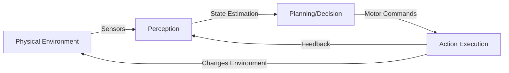

# Foundations of Physical AI

## Learning Objectives

By the end of this chapter, you will be able to:
- Define Physical AI and embodied intelligence with clear examples
- Differentiate between disembodied AI and embodied AI systems
- Explain the perception-action loop and its significance in robotics
- Identify real-world applications of Physical AI in humanoid robotics
- Understand the historical evolution from early robots to modern humanoids

## Introduction

Welcome to the fascinating world of **Physical AI**! Unlike traditional artificial intelligence that exists purely in digital computers, Physical AI operates in the real world through **physical bodies**—robots that can see, touch, move, and interact with their environment.

Imagine the difference between an AI that can describe how to tie shoelaces versus a robot that can actually tie them. The former processes symbols and text; the latter must coordinate vision, touch, and motor control in real-time. This is the essence of **embodied intelligence**: intelligence that emerges from having a body and interacting with the physical world.

In this course, we'll explore how to build humanoid robots—the most complex form of embodied AI—that can walk, manipulate objects, perceive their surroundings, and even understand and respond to human speech.

## What is Physical AI?

### Definition

**Physical AI** (also called **Embodied AI**) is artificial intelligence that:
1. Exists in a physical body (robot)
2. Perceives the world through sensors
3. Acts on the world through actuators
4. Learns from physical interaction

### Disembodied vs. Embodied AI

| Aspect | Disembodied AI | Embodied AI (Physical AI) |
|--------|---------------|--------------------------|
| **Existence** | Software only | Software + Hardware |
| **Input** | Digital data (text, images) | Physical sensors (cameras, force sensors) |
| **Output** | Predictions, text, images | Physical actions (movement, manipulation) |
| **Environment** | Digital/virtual | Physical world |
| **Consequences** | No physical impact | Real-world effects (can cause damage) |
| **Examples** | ChatGPT, DALL-E, AlphaGo | Humanoid robots, drones, autonomous cars |

### Example Comparison

```python
# Disembodied AI: Image Classification
def classify_object(image):
    features = extract_features(image)
    prediction = model.predict(features)
    return prediction  # Returns "cup", "bottle", etc.

# No physical interaction required
result = classify_object(load_image("cup.jpg"))
print(f"This is a {result}")  # Output: "This is a cup"
```

```python
# Embodied AI: Physical Grasping
def grasp_object(robot, object_name):
    # 1. Perceive: Use camera to locate object
    image = robot.camera.capture()
    object_position = detect_object(image, object_name)
    
    # 2. Plan: Calculate grasp approach
    grasp_pose = plan_grasp(object_position, robot.current_pose)
    
    # 3. Act: Execute physical motion
    robot.move_arm(grasp_pose)
    robot.gripper.close()
    
    # 4. Verify: Check if grasp succeeded
    force = robot.force_sensor.read()
    return force > threshold  # True if object held

# Requires physical interaction with real world
robot = HumanoidRobot()
success = grasp_object(robot, "cup")
print(f"Grasp {'succeeded' if success else 'failed'}")
```

## The Perception-Action Loop

Physical AI operates in a continuous feedback loop:



### Components Explained

1. **Perception**: Extracting meaningful information from sensors
   - Cameras → object recognition
   - IMU → orientation and acceleration
   - Force sensors → contact detection

2. **Planning/Decision**: Determining what to do
   - Path planning for navigation
   - Grasp selection for manipulation
   - Behavior selection based on goals

3. **Action Execution**: Controlling motors to achieve desired motion
   - Joint position/velocity control
   - Force control for compliant interaction
   - Balance control for stability

4. **Feedback**: Continuous monitoring to adapt to changes
   - Visual servoing (adjust based on what you see)
   - Impedance control (adjust based on forces felt)
   - Error correction

### Why the Loop Matters

Unlike disembodied AI that makes one-shot predictions, embodied AI must:
- **React** to unexpected changes (object slips, obstacle appears)
- **Adapt** to sensor noise and model uncertainties
- **Learn** from physical interaction outcomes
- **Ensure safety** in real-time

## History of Humanoid Robotics

### Timeline of Key Milestones

```
1973: WABOT-1 (Waseda University) - First full-scale humanoid
1986: Honda E0 - Beginning of Honda humanoid research
2000: ASIMO - Advanced Step in Innovative Mobility
2013: Atlas (Boston Dynamics) - DARPA Robotics Challenge
2021: Tesla Optimus announced
2023: Figure 01, 1X Technologies NEO - Commercial humanoids
2024: OpenAI + Figure partnership - VLA-powered humanoids
```

### Notable Humanoid Robots

#### ASIMO (Honda, 2000-2018)
- Height: 130 cm
- Weight: 48 kg
- **Achievements**: Walking, running, stairs, carrying trays
- **Limitation**: Fully pre-programmed, limited autonomy

#### Atlas (Boston Dynamics, 2013-Present)
- Height: 150 cm
- Weight: 89 kg
- **Achievements**: Parkour, backflips, dancing, terrain navigation
- **Technology**: Hydraulic actuation, advanced balance control
- **Recent**: Can now pick up and throw objects

#### Tesla Optimus (2021-Present)
- Height: 173 cm (human-scale)
- Weight: 73 kg
- **Goal**: General-purpose humanoid for everyday tasks
- **Technology**: Electric actuation, AI-based control
- **Vision**: Mass production for home/workplace assistance

#### Figure 01 (Figure AI, 2023-Present)
- Focus: Warehouse and manufacturing tasks
- **Innovation**: Integration with OpenAI models for language understanding
- **Demo**: Can respond to verbal commands and execute manipulation

### Evolution of Capabilities

| Generation | Era | Control Approach | Capabilities |
|-----------|-----|------------------|--------------|
| **Gen 1** | 1970s-1990s | Scripted motions | Basic walking, pre-programmed tasks |
| **Gen 2** | 2000s | Model-based control | Stable walking, stairs, simple manipulation |
| **Gen 3** | 2010s | Learning-based | Dynamic motions, terrain adaptation |
| **Gen 4** | 2020s | Foundation models + RL | Natural language understanding, general tasks |

## Applications of Physical AI in Humanoid Robotics

### 1. Manufacturing and Warehousing

**Use Case**: Collaborative assembly, material handling

```python
# Example: Humanoid assembly worker
class AssemblyWorker:
    def __init__(self, robot):
        self.robot = robot
        self.current_task = None
        
    def execute_task(self, task_description):
        """
        Convert natural language task to actions
        Example: "Install the battery in the device"
        """
        # 1. Parse task
        steps = self.task_parser.parse(task_description)
        
        # 2. For each step
        for step in steps:
            if step.type == "PICK":
                self.robot.grasp(step.object_name)
            elif step.type == "PLACE":
                self.robot.place(step.target_location)
            elif step.type == "MANIPULATE":
                self.robot.execute_skill(step.skill_name)
        
        return "Task completed"

# Usage
worker = AssemblyWorker(humanoid_robot)
worker.execute_task("Install the battery in the device")
```

**Real Example**: Figure 01 at BMW manufacturing

### 2. Healthcare and Assistance

**Use Case**: Patient mobility assistance, fetch-and-carry tasks

- Helping elderly patients stand/walk
- Retrieving medications and supplies
- Providing companionship
- Emergency response (carrying injured person)

**Challenge**: Requires gentle force control and high reliability

### 3. Disaster Response

**Use Case**: Search and rescue, hazardous environment exploration

- Navigate rubble and debris
- Open doors and valves
- Carry equipment
- Operate in radiation/chemical contamination

**Real Example**: DARPA Robotics Challenge (2013-2015)

### 4. Domestic Service

**Use Case**: Household chores, eldercare

```python
# Example: Domestic service commands
commands = [
    "Clean up the toys in the living room",
    "Bring me a glass of water",
    "Load the dishwasher",
    "Water the plants"
]

for command in commands:
    robot.understand_and_execute(command)
```

**Companies Working on This**: Tesla (Optimus), 1X Technologies (NEO)

### 5. Space Exploration

**Use Case**: Astronaut assistance on ISS/Moon/Mars

- Equipment maintenance
- Scientific experiments
- Extravehicular activities (EVA)
- Construction tasks

**Real Example**: NASA Valkyrie (R5)

## Why Humanoid Form Factor?

You might ask: "Why build humanoid robots? Wouldn't specialized robots be better?"

### Advantages of Humanoid Design

1. **Human Environment Compatibility**
   - Designed for human spaces (doorways, stairs, workspaces)
   - Can use human tools without modification
   - Fits in cars, elevators, etc.

2. **Intuitive Human-Robot Interaction**
   - Familiar form enables natural communication
   - Eye contact, gestures, pointing
   - Easier to predict robot intentions

3. **General-Purpose Capability**
   - One robot, many tasks
   - Adaptable to new scenarios
   - Cost-effective at scale

4. **Leveraging Human Data**
   - Massive amounts of human demonstration videos
   - Transfer learning from human kinematic data
   - Imitation learning from human teachers

### Challenges of Humanoid Design

1. **Complexity**: 30+ degrees of freedom to coordinate
2. **Balance**: Bipedal locomotion is inherently unstable
3. **Energy**: Battery life of 1-2 hours typical
4. **Cost**: Expensive actuators and sensors
5. **Safety**: High-power actuators near humans

## Current State of Physical AI

### What Works Today (2024)

✅ **Bipedal walking** on flat and uneven terrain  
✅ **Object manipulation** for known objects  
✅ **Basic language understanding** (VLA models)  
✅ **Teleoperation** with human in the loop  
✅ **Warehouse tasks** (repetitive, structured)

### Active Research Areas

🔬 **Dexterous manipulation** of novel objects  
🔬 **Natural conversation** with task grounding  
🔬 **Whole-body planning** for complex tasks  
🔬 **Long-horizon autonomy** (multi-hour tasks)  
🔬 **Learning from few demonstrations**  
🔬 **Safe physical interaction** with humans

### The Role of Foundation Models

Recent breakthrough: **Vision-Language-Action (VLA) models**

```python
# Conceptual VLA interface
vla_model = VLAModel.load("openai-vla-humanoid")

# Natural language command
command = "Go to the kitchen and bring me the red cup from the top shelf"

# VLA processes:
# 1. Vision: Perceive environment
# 2. Language: Understand command
# 3. Action: Generate motion plan
actions = vla_model.plan(
    camera_image=robot.camera.capture(),
    language_command=command,
    robot_state=robot.get_state()
)

# Execute actions
robot.execute(actions)
```

**Key Players**: OpenAI + Figure, Google DeepMind (RT-2), Physical Intelligence

## The Path Ahead: This Course

Over the next 13 weeks, you'll gain hands-on experience building Physical AI systems:

**Weeks 1-2** (now!): Foundations and theory  
**Weeks 3-5**: ROS 2 programming for robot control  
**Weeks 6-7**: Simulation with Gazebo and URDF  
**Weeks 8-10**: Advanced perception with Isaac Sim  
**Weeks 11-12**: Humanoid locomotion and kinematics  
**Week 13**: Conversational robotics with Whisper + GPT

## Hands-On Lab

### Lab 1.1: Humanoid Robot Analysis

**Objective**: Compare three commercial humanoid robots

**Instructions**:

1. **Research**: Find specifications for:
   - Boston Dynamics Atlas
   - Tesla Optimus
   - Figure 01

2. **Compare** across dimensions:
   - Height, weight
   - Degrees of freedom
   - Actuation type (hydraulic, electric)
   - Sensors (cameras, IMU, force sensors)
   - Demonstrated capabilities

3. **Analyze**: Which design choices trade off what?
   - Hydraulic (Atlas) → Power vs. complexity
   - Electric (Optimus) → Efficiency vs. torque

4. **Document**: Create comparison table in Markdown

### Lab 1.2: Embodied AI Scenarios

**Objective**: Design embodied AI solutions for real problems

**Scenarios**:

1. **Elderly Care**: Design a robot companion for seniors
   - What sensors needed?
   - What key capabilities?
   - What safety considerations?

2. **Warehouse Automation**: Humanoid for inventory management
   - Advantages over wheeled robots?
   - Challenges to overcome?

3. **Space Station**: Robot assistant for astronauts
   - How does microgravity change design?
   - What new capabilities needed?

**Deliverable**: 2-page design document per scenario

## Challenge Exercise

### Design Your Ideal Humanoid

**Task**: Conceptual design of a humanoid robot for a specific application of your choice.

**Requirements**:
1. **Application description**: What will it do?
2. **Mechanical design**: height, weight, DOF, actuation
3. **Sensor suite**: What sensors and why?
4. **Control architecture**: How does it make decisions?
5. **AI/ML components**: What algorithms?
6. **Deployment considerations**: Cost, safety, battery life

**Format**: 4-5 page technical report with diagrams

## Summary

✅ **Physical AI** is intelligence embodied in physical robots that perceive and act in the real world

✅ Unlike **disembodied AI**, Physical AI must handle real-time constraints, sensor noise, and physical consequences

✅ The **perception-action loop** is fundamental: sense → plan → act → feedback

✅ **Humanoid robots** have evolved from scripted walkers (ASIMO) to AI-powered general assistants (Optimus, Figure 01)

✅ Applications span **manufacturing, healthcare, disaster response, domestic service, and space exploration**

✅ **Humanoid form factor** enables using human environments and tools, but adds complexity

✅ **Current frontier**: Vision-Language-Action models that ground natural language in physical actions

✅ This course will teach you to build complete humanoid systems from simulation to conversational control

## Quiz Questions (Self-Assessment)

1. **What is the key difference between disembodied and embodied AI?**
   - A) Embodied AI is smarter
   - B) Embodied AI has a physical body and interacts with the real world
   - C) Disembodied AI is more powerful
   - D) They are the same thing

2. **In the perception-action loop, what comes after "Perception"?**
   - A) Action Execution
   - B) Sensor Reading
   - C) Planning/Decision
   - D) Feedback

3. **Which company created the Atlas humanoid robot?**
   - A) Tesla
   - B) Boston Dynamics
   - C) Honda
   - D) Figure AI

4. **What is a key advantage of the humanoid form factor?**
   - A) Cheaper to build
   - B) More stable than wheeled robots
   - C) Can use environments and tools designed for humans
   - D) Simpler control algorithms

5. **What does VLA stand for in modern robotics?**
   - A) Very Large Actuator
   - B) Vision-Language-Action
   - C) Virtual Learning Assistant
   - D) Velocity-Limited Algorithm

**Answers**: 1-B, 2-C, 3-B, 4-C, 5-B

## Further Reading

### Papers
1. "Embodied Intelligence via Learning and Evolution" (Bongard et al., Nature, 2006)
2. "RT-2: Vision-Language-Action Models Transfer Web Knowledge to Robotic Control" (Google DeepMind, 2023)
3. "Tesla AI Day 2022: Optimus" (Tesla, 2022)

### Books
1. "Humanoid Robotics: A Reference" edited by Ambarish Goswami and Prahlad Vadakkepat
2. "How the Body Shapes the Mind" by Shaun Gallagher
3. "Probabilistic Robotics" by Thrun, Burgard, and Fox

### Videos
1. Boston Dynamics Atlas demonstration videos (YouTube)
2. "The Future of Robotics" - Lex Fridman Podcast episodes
3. Tesla AI Day presentations

### Online Resources
1. [Boston Dynamics](https://www.bostondynamics.com/)
2. [Figure AI](https://www.figure.ai/)
3. [Tesla Bot Updates](https://www.tesla.com/AI)

---

**Next Chapter**: [Embodied Intelligence Architecture](./embodied-intelligence-architecture) - Deep dive into sensor-motor integration and control hierarchies
