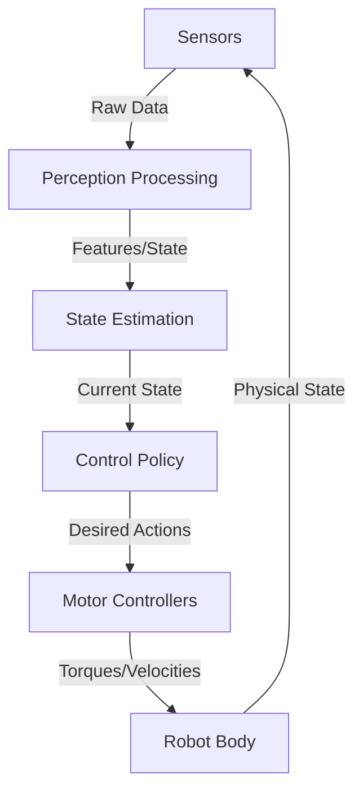
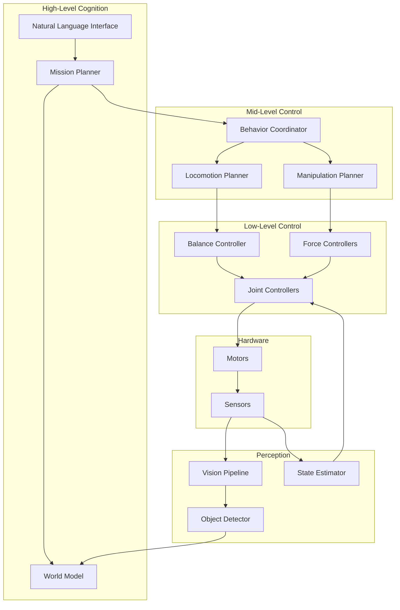

# Embodied Intelligence Architecture

## Learning Objectives

By the end of this chapter, you will be able to:
- Understand the integration of sensors and motors in embodied systems
- Explain hierarchical control architectures for humanoid robots
- Identify key subsystems (perception, planning, control) and their interactions
- Design high-level software architecture for a humanoid robot
- Recognize real-time constraints in Physical AI systems

## Introduction

In Week 1, we explored **what** Physical AI is. This week, we dive into **how** it's built. A humanoid robot is not just a collection of motors and sensors—it's a carefully orchestrated system where perception, cognition, and action work in harmony.

Think of a humanoid robot like a symphony orchestra: the sensors are the ears, the computer is the conductor, and the motors are the musicians. Each must play their part precisely and in sync for beautiful motion to emerge.

In this chapter, we'll explore the architectural patterns that make this possible, from hardware integration to software design.

## Sensor-Motor Integration

### The Sensorimotor Loop



### Sensor Types in Humanoid Robots

#### Exteroceptive Sensors (External World)

| Sensor | Measurement | Frequency | Use Case |
|--------|-------------|-----------|----------|
| **RGB Camera** | Color images | 30-60 Hz | Object recognition, navigation |
| **Depth Camera** | Distance to surfaces | 30-60 Hz | 3D mapping, obstacle avoidance |
| **LIDAR** | 360° range | 10-40 Hz | SLAM, localization |
| **Microphone Array** | Sound/direction | 16-48 kHz | Voice commands, sound localization |
| **Tactile Sensors** | Contact force/pressure | 100-1000 Hz | Grasping, manipulation |

#### Proprioceptive Sensors (Self-State)

| Sensor | Measurement | Frequency | Use Case |
|--------|-------------|-----------|----------|
| **Joint Encoders** | Joint angles | 100-1000 Hz | Forward kinematics, feedback control |
| **IMU** | Accel + Gyro | 100-1000 Hz | Balance, orientation estimation |
| **Force/Torque** | Joint forces | 100-1000 Hz | Impedance control, load estimation |
| **Current Sensors** | Motor current | 1-10 kHz | Torque estimation, safety limits |

### ROS 2 Sensor Integration Example

```python
import rclpy
from rclpy.node import Node
from sensor_msgs.msg import Image, Imu, JointState
from geometry_msgs.msg import WrenchStamped
import numpy as np

class SensorFusion(Node):
    def __init__(self):
        super().__init__('sensor_fusion')
        
        # Subscribe to all sensors
        self.create_subscription(Image, '/camera/image', self.image_callback, 10)
        self.create_subscription(Imu, '/imu/data', self.imu_callback, 10)
        self.create_subscription(JointState, '/joint_states', self.joint_callback, 10)
        self.create_subscription(WrenchStamped, '/ft_sensor', self.force_callback, 10)
        
        # State storage
        self.latest_image = None
        self.orientation = None
        self.joint_positions = None
        self.contact_force = None
        
    def image_callback(self, msg):
        self.latest_image = msg
        self.get_logger().debug('Image received')
        
    def imu_callback(self, msg):
        self.orientation = msg.orientation
        self.get_logger().debug(f'IMU: Roll/Pitch/Yaw estimated')
        
    def joint_callback(self, msg):
        self.joint_positions = np.array(msg.position)
        # Can now compute forward kinematics
        
    def force_callback(self, msg):
        self.contact_force = msg.wrench.force
        if np.linalg.norm([self.contact_force.x, 
                          self.contact_force.y, 
                          self.contact_force.z]) > 50.0:
            self.get_logger().warn('High contact force detected!')
```

## Control Hierarchies

Modern humanoid robots use **hierarchical control** with multiple layers:

### Three-Layer Architecture

```
┌─────────────────────────────────────┐
│    Mission Planning (1-10 Hz)       │  High-level decisions
│  "Navigate to kitchen, get cup"     │  Language → Task decomposition
└─────────────┬───────────────────────┘
              │
┌─────────────▼───────────────────────┐
│  Behavior Coordination (10-100 Hz)  │  Mid-level control
│  Footstep planning, Grasp selection │  Task → Motion primitives
└─────────────┬───────────────────────┘
              │
┌─────────────▼───────────────────────┐
│   Low-Level Control (100-1000 Hz)   │  Motor control
│  PID, Torque control, Balance       │  Motion → Joint commands
└─────────────────────────────────────┘
```

### Implementation Example

```python
class HumanoidController:
    """Hierarchical control for humanoid robot"""
    
    def __init__(self, robot):
        self.robot = robot
        
        # High-level planner
        self.mission_planner = MissionPlanner()
        
        # Mid-level behaviors
        self.behavior_manager = BehaviorManager()
        
        # Low-level controllers
        self.motor_controller = MotorController(robot)
        
    def control_loop(self):
        """Main control loop at 100 Hz"""
        rate = self.robot.create_rate(100)  # Hz
        
        while True:
            # 1. High-level: Update plan every 1 second
            if self.robot.get_time() % 1.0 < 0.01:
                current_task = self.mission_planner.get_current_task()
                self.behavior_manager.set_task(current_task)
            
            # 2. Mid-level: Generate desired motion (10 Hz)
            if self.robot.get_time() % 0.1 < 0.01:
                desired_motion = self.behavior_manager.compute_motion(
                    robot_state=self.robot.get_state()
                )
            
            # 3. Low-level: Compute motor commands (100 Hz)
            motor_commands = self.motor_controller.compute_torques(
                desired_motion,
                actual_state=self.robot.get_state()
            )
            
            # 4. Send to robot
            self.robot.set_motor_torques(motor_commands)
            
            rate.sleep()
```

## Key Subsystems Architecture

### Complete System Diagram



### Subsystem Descriptions

#### 1. Perception System

**Responsibility**: Convert raw sensor data into semantic understanding

```python
class PerceptionSystem:
    def __init__(self):
        self.object_detector = ObjectDetector("yolov8")
        self.depth_estimator = DepthEstimator()
        self.slam = VisualSLAM()
        
    def process_frame(self, rgb_image, depth_image):
        # Object detection
        objects = self.object_detector.detect(rgb_image)
        
        # 3D localization
        objects_3d = []
        for obj in objects:
            x, y, w, h = obj.bbox
            depth = depth_image[y:y+h, x:x+w].mean()
            position_3d = self.pixel_to_3d(x, y, depth)
            objects_3d.append({
                'class': obj.class_name,
                'position': position_3d,
                'confidence': obj.confidence
            })
        
        # Update SLAM map
        robot_pose = self.slam.update(rgb_image, depth_image)
        
        return {
            'objects': objects_3d,
            'robot_pose': robot_pose
        }
```

#### 2. Planning System

**Responsibility**: Generate motion plans to achieve goals

```python
class PlanningSystem:
    def __init__(self, urdf_path):
        self.robot_model = RobotModel(urdf_path)
        self.motion_planner = MotionPlanner()
        
    def plan_manipulation(self, target_object, grasp_type="top"):
        """Plan arm motion to grasp object"""
        
        # 1. Select grasp pose
        grasp_pose = self.compute_grasp_pose(target_object, grasp_type)
        
        # 2. Inverse kinematics
        joint_config = self.robot_model.inverse_kinematics(
            end_effector_pose=grasp_pose
        )
        
        # 3. Motion planning (collision-free path)
        path = self.motion_planner.plan(
            start=self.robot_model.current_config,
            goal=joint_config,
            obstacles=self.world_model.obstacles
        )
        
        return path
    
    def plan_footsteps(self, goal_position):
        """Plan walking path"""
        footsteps = []
        
        # Simplified: alternate left-right steps
        current_pos = self.robot_model.base_position
        step_length = 0.3  # meters
        
        while distance(current_pos, goal_position) > step_length:
            # Alternate feet
            foot = "left" if len(footsteps) % 2 == 0 else "right"
            next_step = self.compute_next_step(current_pos, goal_position, step_length)
            
            footsteps.append({
                'foot': foot,
                'position': next_step,
                'orientation': self.compute_step_orientation()
            })
            
            current_pos = next_step
        
        return footsteps
```

#### 3. Control System

**Responsibility**: Execute plans with feedback control

```python
class ControlSystem:
    def __init__(self):
        self.pid_controllers = {}
        
        # Create PID for each joint
        for joint in robot_joints:
            self.pid_controllers[joint] = PIDController(
                kp=100.0, ki=1.0, kd=10.0
            )
    
    def compute_joint_torques(self, desired_positions, current_state):
        """Low-level joint control"""
        torques = {}
        
        for joint in robot_joints:
            desired = desired_positions[joint]
            actual = current_state.positions[joint]
            
            # PID control
            torque = self.pid_controllers[joint].compute(
                setpoint=desired,
                measured=actual,
                dt=0.001  # 1 kHz control
            )
            
            # Safety limits
            torques[joint] = np.clip(torque, -max_torque, max_torque)
        
        return torques
    
    def balance_controller(self, desired_com, actual_com):
        """Center of mass balance control"""
        com_error = desired_com - actual_com
        
        # Simple proportional control
        # (Real systems use more sophisticated ZMP control)
        ankle_torque = 500.0 * com_error
        
        return ankle_torque
```

## Real-Time Constraints

### Timing Requirements

| Subsystem | Update Rate | Max Latency | Consequence of Delay |
|-----------|-------------|-------------|---------------------|
| **Joint Control** | 1000 Hz | 1 ms | Instability, oscillation |
| **Balance Control** | 100-500 Hz | 10 ms | Fall risk |
| **Vision Processing** | 30-60 Hz | 33 ms | Outdated world model |
| **Motion Planning** | 1-10 Hz | 1 s | Slow response |
| **Language Processing** | 1 Hz | 10 s | Poor user experience |

### ROS 2 Real-Time Configuration

```cpp
// C++ example: Real-time capable node
#include <rclcpp/rclcpp.hpp>
#include <rclcpp/executors.hpp>

class RealTimeController : public rclcpp::Node {
public:
    RealTimeController() : Node("rt_controller") {
        // Create timer with real-time priority
        timer_ = this->create_wall_timer(
            std::chrono::microseconds(1000),  // 1 kHz
            std::bind(&RealTimeController::control_loop, this)
        );
        
        // Set QoS for reliable, low-latency communication
        auto qos = rclcpp::QoS(rclcpp::KeepLast(10))
            .reliability(RMW_QOS_POLICY_RELIABILITY_BEST_EFFORT)
            .durability(RMW_QOS_POLICY_DURABILITY_VOLATILE);
        
        joint_cmd_pub_ = this->create_publisher<JointCommand>(
            "joint_commands", qos
        );
    }
    
private:
    void control_loop() {
        auto start = std::chrono::high_resolution_clock::now();
        
        // Control computation
        auto commands = compute_control();
        joint_cmd_pub_->publish(commands);
        
        auto end = std::chrono::high_resolution_clock::now();
        auto duration = std::chrono::duration_cast<std::chrono::microseconds>(end - start);
        
        if (duration.count() > 800) {  // Warn if > 800 μs
            RCLCPP_WARN(this->get_logger(), "Control loop slow: %ld μs", duration.count());
        }
    }
    
    rclcpp::TimerBase::SharedPtr timer_;
    rclcpp::Publisher<JointCommand>::SharedPtr joint_cmd_pub_;
};
```

## Software Architecture Patterns

### Pattern 1: Component-Based Architecture

```python
class Component:
    """Base class for all robot components"""
    def __init__(self, name):
        self.name = name
        self.inputs = {}
        self.outputs = {}
    
    def update(self, dt):
        """Override in subclasses"""
        raise NotImplementedError

class VisionComponent(Component):
    def update(self, dt):
        image = self.inputs['camera_image']
        detections = self.process_image(image)
        self.outputs['objects'] = detections

class PlannerComponent(Component):
    def update(self, dt):
        objects = self.inputs['objects']
        robot_state = self.inputs['robot_state']
        plan = self.compute_plan(objects, robot_state)
        self.outputs['motion_plan'] = plan

class RobotSystem:
    def __init__(self):
        self.components = [
            VisionComponent("vision"),
            PlannerComponent("planner"),
            ControlComponent("controller")
        ]
        
        # Wire components together
        self.connect("vision", "objects", "planner", "objects")
    
    def run(self):
        """Main loop"""
        for component in self.components:
            component.update(dt=0.01)
```

### Pattern 2: Behavior Trees

```python
from enum import Enum

class Status(Enum):
    SUCCESS = 1
    FAILURE = 2
    RUNNING = 3

class BehaviorNode:
    def tick(self):
        raise NotImplementedError

class SequenceNode(BehaviorNode):
    """Execute children in sequence"""
    def __init__(self, children):
        self.children = children
        self.current = 0
    
    def tick(self):
        while self.current < len(self.children):
            status = self.children[self.current].tick()
            
            if status == Status.RUNNING:
                return Status.RUNNING
            elif status == Status.FAILURE:
                return Status.FAILURE
            else:  # SUCCESS
                self.current += 1
        
        return Status.SUCCESS

# Example: "Pick up cup" behavior tree
pick_up_cup = SequenceNode([
    DetectCup(),
    ApproachCup(),
    OpenGripper(),
    GraspCup(),
    LiftCup()
])
```

## Hands-On Lab

### Lab 2.1: Design a Control Architecture

**Objective**: Design the software architecture for a warehouse humanoid robot

**Requirements**:
1. Robot must navigate warehouse aisles
2. Pick items from shelves (0.5m to 2m height)
3. Place items in bins
4. Respond to voice commands
5. Avoid obstacles and humans

**Deliverable**:
- Component diagram showing all subsystems
- Data flow diagram
- Timing analysis (which components at which rates)

### Lab 2.2: Implement Sensor Fusion Node

```python
# TODO: Complete this ROS 2 node
class SensorFusionNode(Node):
    def __init__(self):
        super().__init__('sensor_fusion')
        
        # TODO: Subscribe to:
        # - /camera/rgb/image
        # - /camera/depth/image
        # - /imu/data
        # - /joint_states
        
        # TODO: Publish fused state estimate
        # - robot pose (from IMU + vision)
        # - detected objects with 3D positions
        # - obstacle map
        
        pass
    
    def fuse_sensors(self):
        # TODO: Implement sensor fusion
        # Combine IMU orientation with visual odometry
        # Use depth to localize detected objects
        pass
```

## Summary

✅ **Sensor-motor integration** is the foundation of embodied intelligence

✅ **Hierarchical control** separates high-level planning (1-10 Hz) from low-level control (100-1000 Hz)

✅ **Key subsystems** include perception, planning, control, each with specific responsibilities

✅ **Real-time constraints** require careful timing analysis and priority management

✅ **Software patterns** like component-based architecture and behavior trees enable modular design

✅ **ROS 2** provides the middleware for integrating all subsystems with QoS control

## Further Reading

- "A Roadmap for US Robotics" - From Internet to Robotics (2020 Edition)
- "Principles of Robot Motion" by Choset et al.
- "Planning Algorithms" by Steven LaValle (open access)
- ROS 2 Control Documentation: https://control.ros.org/

---

**Next Chapter**: [ROS 2 Ecosystem and Nodes](../week03-05-ros2-fundamentals/ros2-ecosystem-and-nodes)
