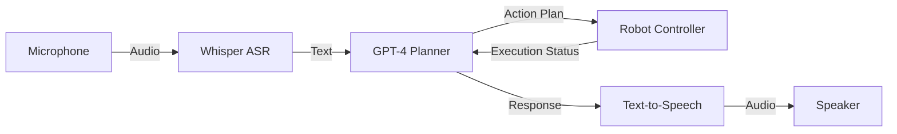

# Speech-to-Action with Whisper and GPT

## Learning Objectives

- Integrate OpenAI Whisper for real-time speech recognition
- Use GPT models for natural language understanding and task planning
- Map language commands to robot actions (language grounding)
- Build an end-to-end conversational robot system
- Handle multi-turn dialogue and error recovery

## Introduction

Welcome to Week 13—the culmination of your humanoid robotics journey! This chapter brings together everything you've learned: ROS 2, simulation, locomotion, kinematics, and now adds the missing piece: **natural conversation**.

Imagine saying "Pick up the red cup from the table" and watching your humanoid robot understand, plan, and execute the entire task autonomously. That's the power of **conversational robotics**.

## System Architecture



## Speech Recognition with Whisper

### Installation

```bash
pip install openai-whisper
# Or for faster inference:
pip install faster-whisper
```

### ROS 2 Whisper Node

```python
import whisper
import numpy as np
from rclpy.node import Node
from audio_common_msgs.msg import AudioData
from std_msgs.msg import String

class WhisperNode(Node):
    def __init__(self):
        super().__init__('whisper_node')
        
        # Load Whisper model
        self.get_logger().info('Loading Whisper model...')
        self.model = whisper.load_model("base")  # base, small, medium, large
        self.get_logger().info('Whisper model loaded')
        
        # Audio subscription
        self.audio_sub = self.create_subscription(
            AudioData,
            '/audio/audio',
            self.audio_callback,
            10
        )
        
        # Transcription publisher
        self.text_pub = self.create_publisher(String, '/speech/text', 10)
        
        # Buffer for audio
        self.audio_buffer = []
        self.buffer_duration = 3.0  # seconds
        self.sample_rate = 16000
    
    def audio_callback(self, msg):
        # Accumulate audio
        audio_chunk = np.frombuffer(msg.data, dtype=np.int16).astype(np.float32) / 32768.0
        self.audio_buffer.extend(audio_chunk)
        
        # Check if buffer is full
        if len(self.audio_buffer) >= self.sample_rate * self.buffer_duration:
            self.transcribe()
            self.audio_buffer = []
    
    def transcribe(self):
        """Transcribe accumulated audio buffer"""
        try:
            audio_array = np.array(self.audio_buffer)
            
            # Transcribe with Whisper
            result = self.model.transcribe(
                audio_array,
                language='en',
                task='transcribe'
            )
            
            text = result['text'].strip()
            
            if text:
                self.get_logger().info(f'Transcribed: "{text}"')
                
                # Publish transcription
                msg = String()
                msg.data = text
                self.text_pub.publish(msg)
        
        except Exception as e:
            self.get_logger().error(f'Transcription error: {e}')
```

## Natural Language Understanding with GPT

### GPT Action Planner

```python
import openai
from openai import OpenAI
import json

class GPTActionPlanner(Node):
    def __init__(self):
        super().__init__('gpt_planner')
        
        # OpenAI API
        self.client = OpenAI(api_key='your-api-key')
        
        # System prompt defines robot capabilities
        self.system_prompt = """
        You are a humanoid robot control system. You can:
        1. Navigate to locations: navigate(location)
        2. Pick up objects: grasp(object_name)
        3. Place objects: place(object_name, location)
        4. Look at objects: look_at(object_name)
        5. Respond verbally: say(message)
        
        Convert user commands into a sequence of these actions in JSON format.
        Always confirm understanding before executing dangerous actions.
        
        Example:
        User: "Bring me the cup from the kitchen"
        Response: {
          "actions": [
            {"action": "navigate", "params": {"location": "kitchen"}},
            {"action": "grasp", "params": {"object": "cup"}},
            {"action": "navigate", "params": {"location": "user"}},
            {"action": "place", "params": {"object": "cup", "location": "user_hand"}},
            {"action": "say", "params": {"message": "Here is your cup"}}
          ]
        }
        """
        
        # Subscribe to speech transcriptions
        self.create_subscription(
            String,
            '/speech/text',
            self.text_callback,
            10
        )
        
        # Publish action sequences
        self.action_pub = self.create_publisher(
            String,  # JSON string of actions
            '/robot/action_plan',
            10
        )
        
        # Conversation history
        self.conversation = []
    
    def text_callback(self, msg):
        """Process transcribed speech"""
        user_text = msg.data
        
        # Get action plan from GPT
        action_plan = self.plan_actions(user_text)
        
        if action_plan:
            # Publish for execution
            plan_msg = String()
            plan_msg.data = json.dumps(action_plan)
            self.action_pub.publish(plan_msg)
    
    def plan_actions(self, user_command):
        """Convert natural language to action sequence using GPT"""
        try:
            # Add user message to conversation
            self.conversation.append({
                "role": "user",
                "content": user_command
            })
            
            # Call GPT-4
            response = self.client.chat.completions.create(
                model="gpt-4",
                messages=[
                    {"role": "system", "content": self.system_prompt},
                    *self.conversation
                ],
                temperature=0.3,  # Lower for more deterministic
                max_tokens=500
            )
            
            # Parse response
            gpt_response = response.choices[0].message.content
            self.conversation.append({
                "role": "assistant",
                "content": gpt_response
            })
            
            # Extract JSON action plan
            try:
                action_plan = json.loads(gpt_response)
                self.get_logger().info(f'Action plan: {action_plan}')
                return action_plan
            except json.JSONDecodeError:
                # GPT might have included explanation text
                # Try to extract JSON from response
                import re
                json_match = re.search(r'\{.*\}', gpt_response, re.DOTALL)
                if json_match:
                    action_plan = json.loads(json_match.group())
                    return action_plan
                else:
                    self.get_logger().error(f'Could not parse GPT response as JSON: {gpt_response}')
                    return None
        
        except Exception as e:
            self.get_logger().error(f'GPT planning error: {e}')
            return None
```

## Action Execution

```python
class ActionExecutor(Node):
    def __init__(self, robot_controller):
        super().__init__('action_executor')
        
        self.robot = robot_controller
        
        #Subscribe to action plans
        self.create_subscription(
            String,
            '/robot/action_plan',
            self.execute_plan,
            10
        )
        
        # Action implementations
        self.action_handlers = {
            'navigate': self.navigate,
            'grasp': self.grasp,
            'place': self.place,
            'look_at': self.look_at,
            'say': self.say
        }
    
    def execute_plan(self, msg):
        """Execute action sequence"""
        try:
            plan = json.loads(msg.data)
            actions = plan.get('actions', [])
            
            for action_spec in actions:
                action_name = action_spec['action']
                params = action_spec.get('params', {})
                
                self.get_logger().info(f'Executing: {action_name}({params})')
                
                # Call appropriate handler
                if action_name in self.action_handlers:
                    success = self.action_handlers[action_name](**params)
                    
                    if not success:
                        self.get_logger().error(f'Action {action_name} failed')
                        break
                else:
                    self.get_logger().warn(f'Unknown action: {action_name}')
        
        except Exception as e:
            self.get_logger().error(f'Execution error: {e}')
    
    def navigate(self, location):
        """Navigate to named location"""
        goal_pose = self.robot.get_location_pose(location)
        return self.robot.navigate_to(goal_pose)
    
    def grasp(self, object_name):
        """Grasp named object"""
        object_pose = self.robot.perceive_object(object_name)
        if object_pose:
            return self.robot.grasp_object(object_pose)
        return False
    
    def place(self, object_name, location):
        """Place object at location"""
        target_pose = self.robot.get_location_pose(location)
        return self.robot.place_object(target_pose)
    
    def look_at(self, object_name):
        """Orient head to look at object"""
        object_pose = self.robot.perceive_object(object_name)
        if object_pose:
            return self.robot.look_at(object_pose)
        return False
    
    def say(self, message):
        """Text-to-speech response"""
        self.get_logger().info(f'Robot says: "{message}"')
        # Integrate TTS here (e.g., gTTS, pyttsx3, or OpenAI TTS)
        return True
```

## Complete System Integration

### Launch File

```python
# launch/conversational_robot.launch.py
from launch import LaunchDescription
from launch_ros.actions import Node

def generate_launch_description():
    return LaunchDescription([
        # Audio capture
        Node(
            package='audio_common',
            executable='audio_capture_node',
            name='audio_capture',
            parameters=[{'format': 1, 'channels': 1, 'sample_rate': 16000}]
        ),
        
        # Whisper ASR
        Node(
            package='humanoid_conversation',
            executable='whisper_node',
            name='whisper',
        ),
        
        # GPT Planner
        Node(
            package='humanoid_conversation',
            executable='gpt_planner',
            name='gpt_planner',
            parameters=[{'openai_api_key': 'your-key-here'}]
        ),
        
        # Action Executor
        Node(
            package='humanoid_conversation',
            executable='action_executor',
            name='action_executor',
        ),
        
        # Robot hardware/simulation
        Node(
            package='humanoid_control',
            executable='robot_controller',
            name='robot_controller',
        ),
    ])
```

## Error Handling and Clarification

```python
class SmartActionPlanner(GPTActionPlanner):
    def handle_ambiguity(self, user_command):
        """Ask for clarification when command is ambiguous"""
        
        clarification_prompt = f"""
        The command "{user_command}" is ambiguous. 
        What clarification question should the robot ask?
        Respond with only the question.
        """
        
        response = self.client.chat.completions.create(
            model="gpt-4",
            messages=[
                {"role": "system", "content": self.system_prompt},
                {"role": "user", "content": clarification_prompt}
            ]
        )
        
        question = response.choices[0].message.content
        self.say(question)
        
        # Wait for user response
        # ... (implement waiting logic)
    
    def verify_dangerous_action(self, action):
        """Confirm with user before dangerous actions"""
        if action['action'] in ['navigate', 'grasp']:
            # Check if action might be dangerous
            if self.is_risky(action):
                confirmation = f"Are you sure you want me to {action['action']}?"
                self.say(confirmation)
                # Wait for yes/no response
                # ...
```

## Final Project: Complete Conversational Humanoid

### Requirements

Build a humanoid robot system that:

1. **Listens** to voice commands (Whisper)
2. **Understands** intent (GPT-4)
3. **Plans** actions (GPT-4 → action sequence)
4. **Executes** in simulation (Gazebo or Isaac Sim)
5. **Responds** with speech (TTS)

### Example Commands to Support

```
"Go to the kitchen"
"Pick up the red block"
"Bring me the cup from the table"
"Wave your right hand"
"What do you see?"
"Find the person wearing blue"
```

### Deliverable

- 5-minute live demonstration
- System architecture diagram
- Code repository
- Documentation (README, setup guide)

## Lab Exercises

### Lab 13.1: Whisper Integration
Integrate Whisper with ROS 2, test recognition accuracy.

### Lab 13.2: GPT Action Planning
Create prompt that converts 20 test commands to action sequences.

### Lab 13.3: End-to-End System
Complete system: speech → understanding → execution → response.

## Summary

✅ **Whisper** provides state-of-the-art speech recognition  
✅ **GPT-4** enables natural language understanding and task planning  
✅ **Language grounding** maps words to physical actions  
✅ **Multi-turn dialogue** handles clarifications and confirmations  
✅ **Complete system** integrates perception, planning, and execution

## Congratulations! 🎊

You've completed the 13-week Humanoid Robotics curriculum! You now have the skills to:

- Build ROS 2 systems for robot control
- Simulate robots in Gazebo and Isaac Sim
- Implement bipedal locomotion
- Solve whole-body kinematics
- Create conversational robot interfaces

**What's Next?**
- Contribute to open-source robotics projects
- Pursue research in embodied AI
- Join robotics companies (Boston Dynamics, Tesla, Figure, etc.)
- Build your own humanoid robot!

## Further Reading

### Papers
- "RT-2: Vision-Language-Action Models" (Google DeepMind, 2023)
- "PaLM-E: An Embodied Multimodal Language Model" (Google, 2023)
- "SayCan: Grounding Language in Robotic Affordances" (Google, 2022)

### Resources
- OpenAI Whisper: https://github.com/openai/whisper
- GPT-4 API: https://platform.openai.com/docs
- Physical AI Research: https://www.physicalintelligence.company/

---

**🌟 You are now ready to build the future of humanoid robotics! 🤖**
